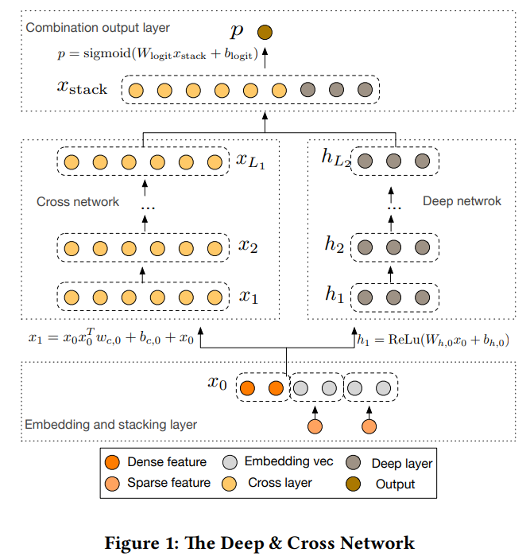
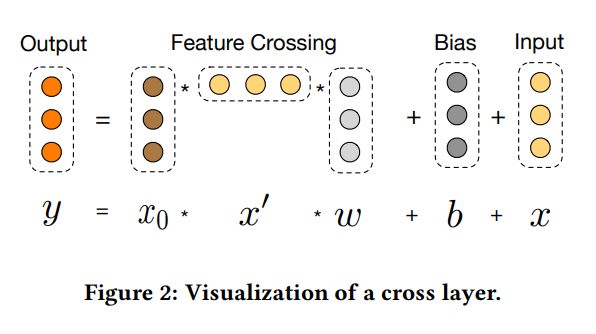

# Replication of Deep & Cross Network Paper (2017)

This repo replicates the [Deep & Cross Network for Ad Click Predictions published
by Wang et al. (2017)](https://arxiv.org/pdf/1708.05123). 

## Model Architecture

Architecture of the complete DCN

source: [Figure 1 Wang et al. (2017)](https://arxiv.org/pdf/1708.05123)

Architecture of single cross network level

source: [Figure 2 Wang et al. (2017)](https://arxiv.org/pdf/1708.05123)

## Data 

The paper uses data in the [Display Advertising Challenge](https://www.kaggle.com/competitions/criteo-display-ad-challenge) on kaggle, which uses a Criteo
dataset. 

The data set is no longer available on kaggle, but is available on [huggingface](https://huggingface.co/datasets/reczoo/Criteo_x1/tree/main)

[Download link](https://huggingface.co/datasets/reczoo/Criteo_x1/resolve/main/Criteo_x1.zip)

Other papers on this data set can be found [here](https://paperswithcode.com/sota/click-through-rate-prediction-on-kkbox)

## Install

You will need to install `poetry` if you don't have it. See 
[https://python-poetry.org/docs/](https://python-poetry.org/docs/).

### Without poetry
If you don't want to use `poetry`, you can try to manually install the python
packages listed under `[tool.poetry.dependencies]` in `pyproject.toml`. For GPU
usage, do `pip install tensorflow[and-cuda]` instead of 
`pip install tensorflow`.

### Using poetry

For GPU enabled.
######  
        `poetry install`

For no GPU enabled.
######  
        `poetry install --without nvidia`

### To enable plotting DAGs
To enable plotting of neural network graph you need `graphvis`.
######  
        sudo apt-get install graphviz

## Run

Download the data. See above. Then run preprocessing. This will save vocabulary
files in `data/vocab`, and save some plots you can view [here](./docs/wiki.md)

######   
        `python preprocessing.py`  

Start up tensorboard to monitor the training. `save_path` is the argument passed
to `DeepCrossNetwork` in `main.py`

######  
        `tensorboard --logdir=./logs/tensorboard/{save_path}`  

Run the training. Perhaps modify the input file from `data/train.csv` to
`data/sample.csv` to do an initial test run (make sure to also remove the
validation file for the test).  

######  
        `python main.py`
