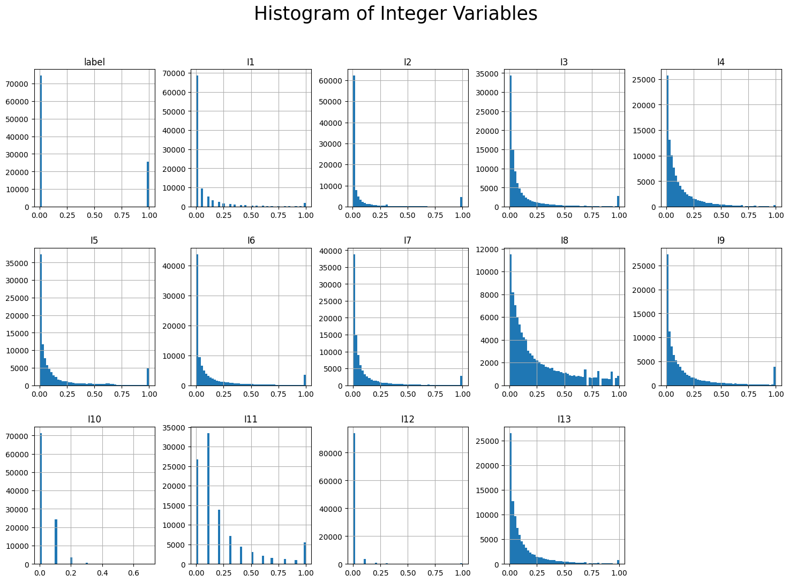
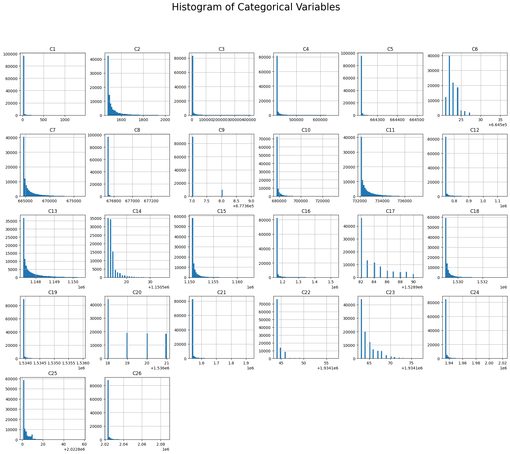
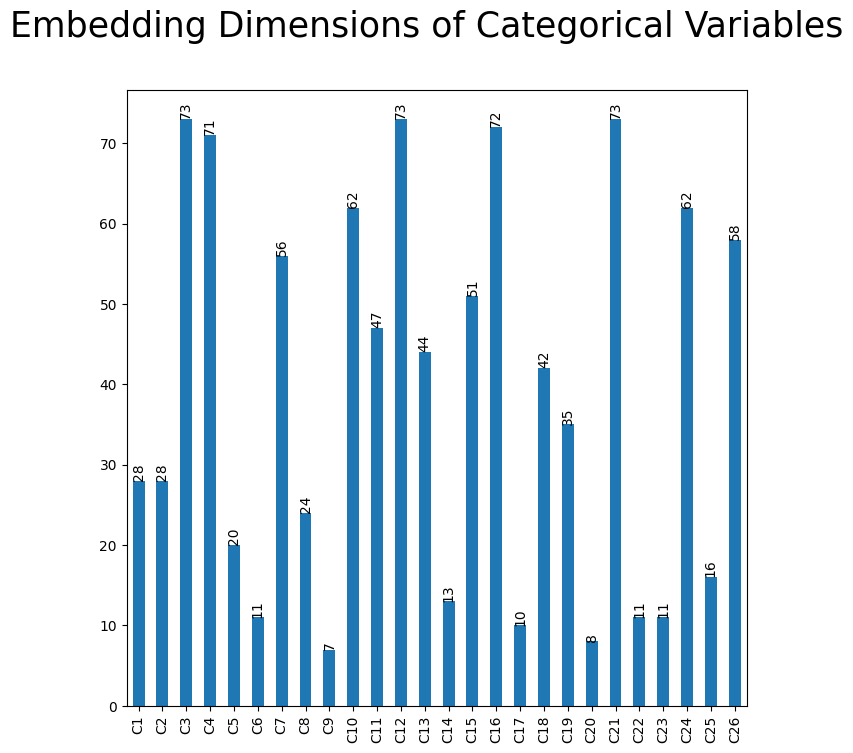

### Data exploration

The data source claims the data is composed of 13 integer features and 26 
categorical features.

The integer features appear to be normalized already. They are all between 0-1.

For the sample data, the categorical variables all have different ranges and the
cardinality ranges from 3 to over 20_000.

The paper states that the dimension of embeddings for categorical features is
`6 x (category cardinality)**0.25`. For simplicity, it's assumed that this also
applies to low cardinality features, so that embedding dim is larger than the
cardinality of these.

Total number of features we end up with is 1005 + 13 = 1018. The paper claims
1026 total features though.

## Details

### Model Architecture Details 

A vanilla MLP ("MLP") and the Deep Cross Network with MLP ("DCN") in the paper
are implemented.

* Real valued features are log transformed in the paper. But the data set comes 
  with normalized values already, so nothing is done to them.
* Categorical features are OHE and embedded 
  * Embedding dimensions are  `int(6 x (category cardinality)**0.25)`
  * After concatenation, there are `1026` dimensions in the paper. Depending on 
  the vocabulary sizes used there are different dimensions here.
    * Complete vocabulary `~1500` embedding units
    * Threshold Frequency >= 10, `~500` embedding units
    * The complete vocabulary is used by default here.
 * Optimizer - `Adam`
 * Batch size - `512` in the paper. `256` here, due to GPU constraints.
 * Learning rate - `[0.0001, ..., 0.001]` in the paper, `0.001` here. 
 * Early stopping at training step 150_000.

Optimal DCN hyperparameters used:
* `2` deep layers of size `1024`
* `6` cross layers

Optimal MLP hyperparameters used:
* `5` deep layers of size `1024`

## Training Resulst

### Deep Cross Network

### MLP without Cross Features 

